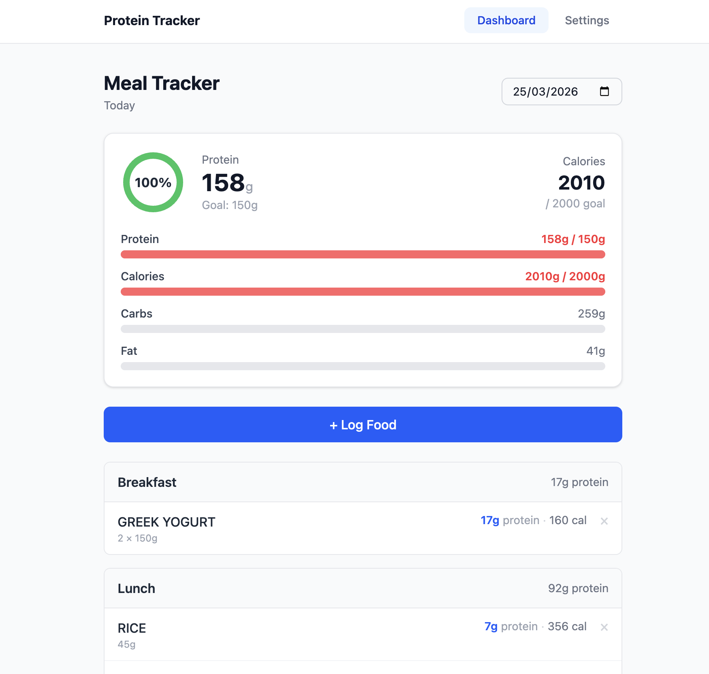

# Protein Meal Planner & Tracker

A single-user web app for logging daily meals, tracking protein and macro intake against configurable goals, and planning the week ahead -- backed by real food data from the USDA database.



---

## What It Does

**Daily tracking.** Log food to breakfast, lunch, dinner, or snacks. Each entry pulls real macro data (calories, protein, carbs, fat) from the USDA FoodData Central database. Today's totals display as a protein ring and progress bars on the dashboard, with a date picker to review or edit any past day.

**Weekly trends.** A bar chart shows protein intake for the past 7 days alongside your goal line. Bars are color-coded by status and the header shows your 7-day average and days-goal-met count.

**Favorite foods.** Star any food in search results to save it. Favorites appear on the dashboard as a quick-log panel -- select a meal type and tap Add without re-searching.

**Recipe discovery.** Search TheMealDB for recipe ideas. Recipes are scored and sorted by protein-rich ingredient count, with a toggleable "High Protein Only" filter. Expandable cards show the full ingredient list and instructions.

**Meal planner.** A 7-day forward view shows planned protein progress for each upcoming day. Expand any day to add or remove items using the standard food search.

---

## Tech Stack

| Layer | Technology | Why |
|---|---|---|
| Frontend | React 19 + Vite | Fast dev server, minimal config overhead |
| Styling | Tailwind CSS v4 | Utility-first, no separate stylesheet to maintain |
| Server state | @tanstack/react-query | Caching, background refetch, mutation handling |
| Charts | Recharts | Composable React-native chart primitives |
| Backend | Node.js + Express | Lightweight, readable, easy to navigate in a portfolio |
| Database | SQLite via @libsql/client | File-based, zero config, WASM build avoids native compilation |
| Food data | USDA FoodData Central API | Free, comprehensive, returns per-serving macros |
| Recipes | TheMealDB API | Free, no key required |

**Why separate client/server instead of Next.js?** A clean split makes the architecture more readable as a portfolio project -- the frontend and API are independently understandable. Next.js would blur that boundary without adding meaningful capability for a single-user local app.

**Why raw SQL instead of an ORM?** The schema is three tables. Raw SQL is more explicit and easier to audit than generated queries at this scale.

---

## Project Structure

```
protein-meal-planner/
├── client/
│   ├── src/
│   │   ├── api/index.js           # fetch wrappers for all endpoints
│   │   ├── components/
│   │   │   ├── FavoritesPanel.jsx
│   │   │   ├── FoodSearchModal.jsx
│   │   │   ├── MacroBar.jsx
│   │   │   ├── MealSection.jsx
│   │   │   └── WeeklyChart.jsx
│   │   ├── pages/
│   │   │   ├── Dashboard.jsx
│   │   │   ├── Planner.jsx
│   │   │   ├── Recipes.jsx
│   │   │   └── Settings.jsx
│   │   ├── App.jsx
│   │   └── main.jsx
│   └── vite.config.js
├── server/
│   ├── __tests__/
│   │   ├── goals.test.js
│   │   └── meals.test.js
│   ├── db/
│   │   ├── database.js            # DB init and singleton client
│   │   └── schema.sql
│   ├── routes/
│   │   ├── favorites.js
│   │   ├── foods.js               # USDA API proxy
│   │   ├── goals.js
│   │   ├── meals.js
│   │   └── recipes.js             # TheMealDB proxy
│   └── index.js
├── .env.example
├── Dashboard.png
└── package.json                   # root dev/test scripts
```

---

## Getting Started

**Prerequisites:** Node.js 18+, and a free USDA API key from [fdc.nal.usda.gov/api-key-signup](https://fdc.nal.usda.gov/api-key-signup) (instant, no approval).

```bash
git clone https://github.com/YOUR_USERNAME/protein-meal-planner.git
cd protein-meal-planner
npm run install:all
cp .env.example .env
```

Open `.env` and set your key:

```
USDA_API_KEY=your_key_here
```

```bash
npm run dev
```

- Frontend: http://localhost:5173
- API server: http://localhost:3001

**Tests** (runs against an in-memory database, no setup needed):

```bash
npm test
```

---

## Features in Detail

**Dashboard** -- protein ring showing % of daily goal, macro progress bars, per-meal sections with inline delete, and a date picker for any day.

**Food Search** -- USDA keyword search with per-serving macro breakdown. Adjust serving size before logging. Star results to save as favorites.

**Weekly Chart** -- 7-day bar chart with a dashed goal reference line. Green = goal met, dark blue = today, light blue = partial, gray = no data. Shows 7-day average and days-goal-met in the header.

**Recipe Search** -- TheMealDB keyword search scored by protein-rich ingredient count. High-protein results sort first; toggle the filter to show only those.

**Meal Planner** -- next 7 days with a per-day protein progress bar. Expand any day to view or edit planned meals using the standard food search flow.

---

## APIs Used

**USDA FoodData Central** -- https://fdc.nal.usda.gov
Free. Requires an API key (instant signup). Rate limit: 1,000 requests/hour per key.

**TheMealDB** -- https://www.themealdb.com
Free, no key required. Does not provide macro data -- protein quality is inferred from ingredient names.

---

## License

MIT
